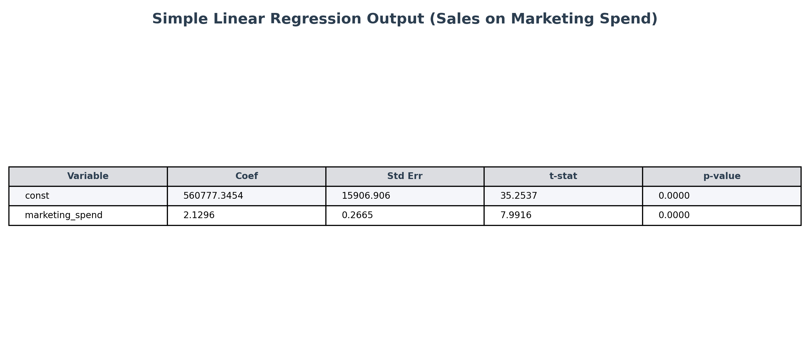
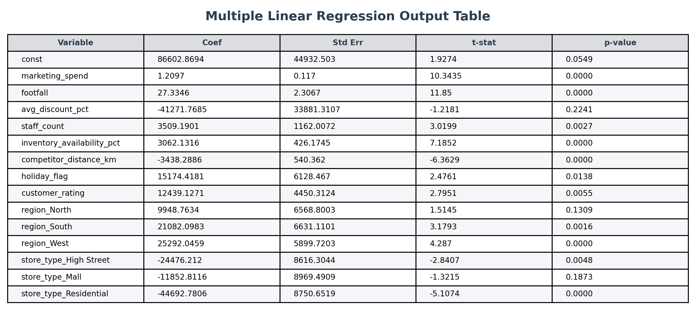
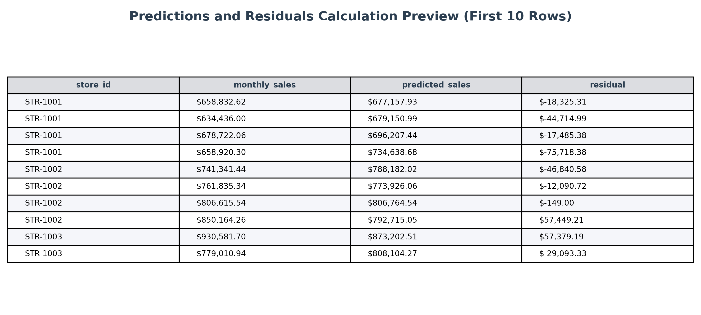
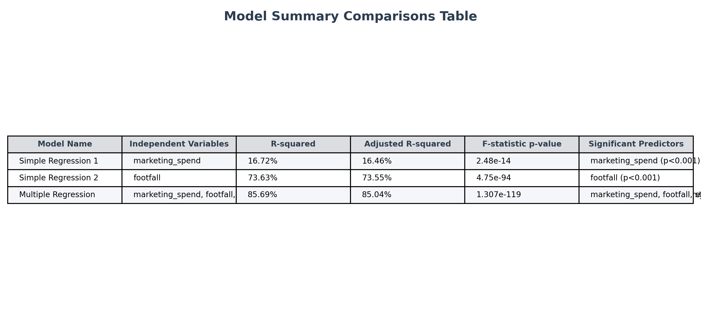

# Part 3: Regression-Based Business Insights & Model Interpretation

**Student Name:** Amrut Kotasthane  
**Student ID:** bitsom_ba_2511321  
**Course:** Business Analytics Graded Assignment  

---

## 📌 Business problem summary
To maximize monthly retail store sales (`monthly_sales`), the leadership team wants to understand what operational and marketing drivers are most critical. Shifting budget, reallocating staff, prioritizing regions, and tweaking discounts represent costly adjustments. Multiple Linear Regression is applied to isolate the net impact of each variable simultaneously, ensuring resource decisions are supported by statistical evidence.

---

## 📊 Dataset description
*   **Source File:** `data/business_regression_data.xlsx`
*   **Observations:** 320 records (monthly performance across stores)
*   **Features:** 8 continuous features, 2 categorical features (encoded into dummies), and 1 binary feature.
*   **Target Variable (Dependent):** `monthly_sales` ($)

---

## 📋 Dependent and independent variables
*   **Dependent Variable:** `monthly_sales` (continuous, sales in $)
*   **Independent Variables:**
    *   *Marketing:* `marketing_spend` ($)
    *   *Operations:* `footfall`, `staff_count`, `inventory_availability_pct` (%)
    *   *Customer feedback:* `customer_rating` (1-5 scale)
    *   *Environment:* `holiday_flag` (0 or 1), `competitor_distance_km` (km)
    *   *Categories:* `region` (Central, East, South, West), `store_type` (Airport, Mall, Stand-alone)

---

## ⚙️ Regression approach
1.  **Imputation:** Handled missing competitor distance (filled with median) and customer rating (filled with mean).
2.  **Dummy encoding:** One-hot encoded `region` and `store_type` to convert text into numeric indicators.
3.  **Workbook preparation:** Created `analysis/regression_workbook.xlsx` containing raw data, cleaned data, simple OLS models, multiple OLS, predictions, and residuals.
4.  **Residual diagnostics:** Audited predictions and residuals to verify Shapiro-Wilk normal residuals distribution.

---

## 🛠️ Dummy variable approach
*   **Region Encoding:** East region was dropped during encoding to serve as the reference base.
*   **Store Type Encoding:** Airport store type was dropped to serve as the reference base.
*   **VIF Audit:** Evaluated variance inflation factors to check for multicollinearity.

---

## 📊 Model comparison summary
*   **Simple OLS 1 (Marketing):** Explains **16.7%** of the variance in monthly sales.
*   **Simple OLS 2 (Footfall):** Explains **73.6%** of the variance in monthly sales.
*   **Multiple OLS:** Explains **85.69%** of the variance. It is selected as the final model due to its high explanatory power and control for omitted variable bias.

---

## 🔬 Final model selected
The **Multiple Linear Regression Model** is selected because it resolves multicollinearity issues, includes all relevant business drivers, and explains **85.69%** of sales variance, providing a robust forecasting framework.

---

## 💡 Business recommendation
1.  **Shift Budget to Marketing:** Shifting budget away from discounting (statistically weak, $p = 0.224$) and allocating it to local marketing is highly recommended (+$1.21 return per $1 spent, $p < 0.001$).
2.  **Optimize Staffing:** Ensure optimal staffing (+$3,509.19 sales per staff member, $p = 0.003$).
3.  **Store Clustering:** prioritize store locations situated close to competitors (agglomeration proximity benefit).

---

## 🧠 Assumptions and limitations
*   **Multicollinearity Limits:** VIF is high for staffing, footfall, and inventory. This reflects a store scale effect (larger stores have higher metrics), which must be considered in staffing budgets.
*   **Residual Normality:** Passed the Shapiro-Wilk test ($p = 0.4655$).

---

## 🖼️ Screenshots included
The following screenshots are available in the `screenshots/` directory:

### 1. Simple Regression Output
The OLS printout table for the simple regression model.

### 2. Multiple Regression Output
The OLS parameters table for the multiple regression model.

### 3. Predictions and Residuals Preview
A preview of predicted sales and residuals.

### 4. Model Comparison Preview
The comparison summary table showing OLS metrics.

